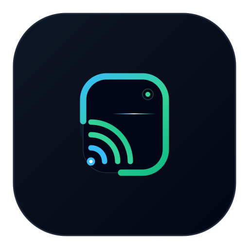

<div align="center">



# BlindCast · 隐播

**安卓硬件级物理熄屏挂机工作站 · 局域网低延迟硬解串流 · scrcpy 级键鼠反向触控 · Chrome 原生侧栏中控台**

[](LICENSE)
[](https://developer.android.com)
[](https://shizuku.rikka.app)
[](chrome-extension/)
[](https://w3c.github.io/webcodecs/)

<p align="center">
  <a href="#-核心特性">核心特性</a> •
  <a href="#-工作原理">工作原理</a> •
  <a href="#-快速上手">快速上手</a> •
  <a href="#-chrome-侧栏中控插件">侧栏中控</a> •
  <a href="#-编译与构建">编译构建</a> •
  <a href="#-开源协议">开源协议</a>
</p>

</div>

---

## 📖 项目简介

在安卓设备上进行长时间游戏托管、自动化脚本运行或后台挂机时，长期面临两大痛点：
1. **屏幕长亮发热严重、耗电飞快、烧屏且容易误触**；
2. **按物理电源键熄屏会导致系统挂起（Doze 深度休眠）、渲染管线暂停、网络断连甚至游戏直接掉线**。

**BlindCast (隐播)** 通过 Android 底层反射技术，实现**屏幕电源物理切断（背光/OLED彻底断电且触控停报）**，同时内部 CPU/GPU 渲染管线保持 **100% 满血运行**。同时手机本地直接暴露局域网服务，用户可以在任何电脑、平板或手机浏览器上，通过 **低延迟硬件解码与 scrcpy 级键鼠映射** 实时监控并反向操控多台挂机设备。

---

## ✨ 核心特性

### ⚡ 硬件级真·物理熄屏 (Hardware Blackout)
- **真断电无光**：通过底层 `SurfaceControl` / `DisplayControl` 物理切断屏幕电源（非全黑遮罩防君子），彻底断绝背光与触控采样，省电防烧屏。
- **满血不休眠**：持有前台守护与底层 `userActivity` 喂狗保活，阻止 Android 触发 Doze 休眠，后台游戏、自动化脚本（如 MAA、各类挂机助手）以完整帧率持续运行。
- **安全防砖兜底**：支持双击物理电源键强制唤醒、Web 控制台一键点亮；当 App 进程异常退出或销毁时自动恢复屏幕电源。

### 🌐 极速局域网串流 (High-Performance Streaming)
- **零弹窗无红点**：特权 VirtualDisplay 原生抓屏，免除系统“正在录制屏幕”隐私确认弹窗与状态栏红点。
- **自适应屏幕比例**：动态读取设备物理分辨率（包括 16:9、18:9、19.5:9、折叠屏及平板），1:1 等比采集，**彻底消除传统投屏工具的左右黑边畸变**。
- **低延迟双模解码**：
  - **WebCodecs 硬件解码**：首选 H.264 硬解链路，浏览器端 Canvas 极速硬解，延迟低至 10~50ms；
  - **无感降级容灾**：在非安全源（未配证书的局域网 HTTP 裸浏览器）下自动自适应切换为流式 JPEG 降级，任何设备打开即看。

### 🖱️ scrcpy 级键鼠反向控制 (Reverse Control)
- **毫秒级触控响应**：内置常驻 Root 输入守护进程，触控与按键注入延迟压至 20~30ms，告别传统 ADB 调用的卡顿感。
- **自然按键映射**：
  - **鼠标右键** ➔ 映射为 Android 返回键 (`KEYCODE_BACK`)；
  - **鼠标中键** ➔ 映射为 Android 桌面键 (`KEYCODE_HOME`)；
  - **鼠标滚轮** ➔ 映射为页面物理平滑滑动；
  - **电脑键盘** ➔ 文本自动输入法映射，支持功能按键直透。

### 🖥️ Chrome 原生侧边栏中控台 (Side Panel Hub)
- **ChatGPT 同款右侧栏**：利用 Chrome 原生 `Side Panel API`，点击浏览器图标在右侧直接滑出集群看板。
- **多设备集群管理**：
  - 局域网 30 线程极速并发扫描，自动发现所有在线挂机设备；
  - 列表式呈现各手机 IP、在线状态、实时电量 🔋、熄屏状态 ⏻；
  - 侧栏直接一键远程熄屏/点亮；
  - 需要精细操作时，一键【🚀 打开投屏】弹出演播厅级独立大标签页全屏操控。

### 🎨 现代设计与高定交互
- 客户端基于 **KernelSU-Style-UI-Kit** 构建，支持 Miuix 质感卡片与 Material 3 双模切换，提供流畅顺滑的触控反馈与深色主题适配。

---

## 🛠️ 工作原理

```text
┌────────────────────────────────────────────────────────┐
│               Android Device (Host)                    │
│                                                        │
│  [Privileged Layer: Root / Shizuku]                    │
│   ├── SurfaceControl / DisplayControl ───> 物理断电屏幕 │
│   ├── RootInputDaemon (Socket) ──────────> 注入触控/按键│
│   └── VirtualDisplay (DisplayManager)                  │
│            │                                           │
│            ▼                                           │
│       MediaCodec (H.264 Hard Encode)                   │
│            │                                           │
│  [Embedded Server: Port 8888]                          │
│   ├── HTTP REST API (/api/status, /api/screen)         │
│   ├── WebSocket Stream (/ws/stream: Video/Audio/JPEG)  │
│   └── WebSocket Control (/ws/control: Touch/Keys)      │
└───────────────────────┬────────────────────────────────┘
                        │ LAN (0.0.0.0:8888)
                        ▼
┌────────────────────────────────────────────────────────┐
│               PC / Tablet / Browser                    │
│                                                        │
│  [Chrome Extension Side Panel]                         │
│   ├── 局域网设备并发发现 (30-thread scan)                │
│   └── 多设备卡片看板 (查看电量 / 一键远程熄屏)           │
│                                                        │
│  [Full Console Tab / Any Browser]                      │
│   ├── WebCodecs / Canvas (硬件低延迟低至 10~50ms)        │
│   └── Mouse & Keyboard (左键触控 / 右键返回 / 打字注入) │
└────────────────────────────────────────────────────────┘
```

---

## 🚀 快速上手

### 1. 手机端准备
1. 下载并安装最新版的 `BlindCast.apk`；
2. 授予提权权限：
   - **Root 模式（推荐）**：支持 KernelSU、APatch、Magisk，在授权管理器中允许 BlindCast 即可；
   - **Shizuku 模式**：启动 Shizuku 服务并授权 BlindCast；
3. 打开 App 首页，点击**「🌐 串流后台总服务」**开关启动服务；
4. 点击**「⚡ 立即息屏挂机」**即可直接验证物理熄屏。

### 2. PC 端 Chrome 侧边栏中控插件安装
1. 打开 Chrome 浏览器，在地址栏输入 `chrome://extensions`；
2. 开启右上角的 **「开发者模式」**；
3. 点击左上角 **「加载已解压的扩展程序」**，选择本项目源码中的 `chrome-extension` 目录；
4. 点击 Chrome 右上角扩展拼图图标，将 **BlindCast Console** 固定在工具栏；
5. 点击图标，即可在浏览器右侧展开原生侧边栏集群中控！

---

## 📦 编译与构建

### 环境要求
- JDK 17+ (推荐 OpenJDK 17)
- Android SDK (compileSdk 35+, minSdk 31)
- Gradle 8.13+

### 构建 APK
```bash
# 配置环境变量
export JAVA_HOME=/path/to/your/jdk-17

# 编译 Debug APK
./gradlew :app:assembleDebug

# 产物路径
# app/build/outputs/apk/debug/BlindCast_0.1.0_100-debug.apk
```

### 安装到测试机
```bash
adb push app/build/outputs/apk/debug/BlindCast_0.1.0_100-debug.apk /data/local/tmp/BlindCast.apk
adb shell pm install -r /data/local/tmp/BlindCast.apk
```

---

## 📄 开源协议

本项目采用 **[GNU Affero General Public License v3.0 (AGPL-3.0)](LICENSE)** 协议开源。

- 本项目的底层 `DisplayControl` 动态载库与底层断电分发机制参考了 [Aliothmoon/MAA-Meow](https://github.com/Aliothmoon/MAA-Meow)（同样基于 AGPL-3.0）及开源社区的最佳实践，特此向相关创作者致谢。
- 遵循开源协议，任何对本项目的修改、派生以及作为网络服务（SaaS/PaaS）提供的衍生作品，均须以相同的 AGPL-3.0 协议公开完整源代码。

---

<div align="center">
  <sub>Crafted with precision for relentless automation & power-saving workstations.</sub>
</div>
